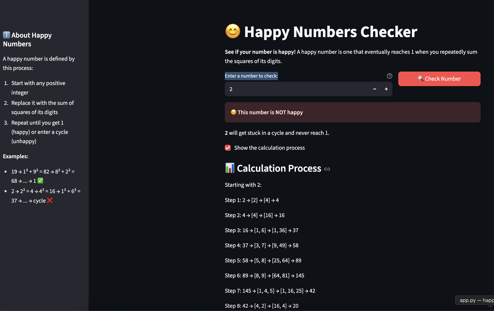
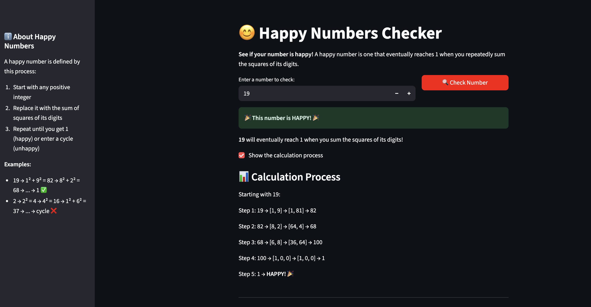

# Happy Numbers Checker

<div align="center">
  
  
</div>

An interactive dashboard that determines whether a given number is "happy" or not. Built with Python and Streamlit, this project combines mathematical concepts with an engaging user interface.

## What are Happy Numbers?

A **happy number** is a number defined by the following process:
1. Start with any positive integer
2. Replace the number by the sum of the squares of its digits
3. Repeat the process until the number equals 1 (where it will stay) or enters a cycle that does not include 1
4. Numbers that end in 1 are happy numbers!

### Examples:
- **19** → 1² + 9² = 82 → 8² + 2² = 68 → 6² + 8² = 100 → 1² + 0² + 0² = 1 **HAPPY**
- **2** → 2² = 4 → 4² = 16 → 1² + 6² = 37 → 3² + 7² = 58 → ... → cycle **NOT HAPPY**

## Features

- **Interactive Number Checker**: Enter any positive integer to check if it's happy
- **Step-by-Step Process**: Visualize how numbers transform through the algorithm
- **Educational Content**: Learn about happy numbers with examples and explanations
- **Real-time Calculation**: Instant results with loading animations

## Getting Started

### Prerequisites
- Python 3.7 or higher
- pip (Python package installer)

### Installation

1. **Clone the repository**
   ```bash
   git clone <https://github.com/Banafshehkh/projects_portfolio.git>
   cd happy_numbers
   ```

2. **Install dependencies**
   ```bash
   pip install streamlit
   ```

3. **Run the application**
   ```bash
   streamlit run src/app.py
   ```

4. **Open your browser**
   - The app will automatically open at `http://localhost:8501`
   - If it doesn't open automatically, copy the URL from the terminal

## Project Structure

```
happy_numbers/
├── README.md
├── src/
│   ├── app.py              # Main Streamlit application
│   ├── happy_numbers.py    # Core algorithm implementation
```

## How It Works

### Algorithm Implementation
The core algorithm in `happy_numbers.py` uses a set to detect cycles:

### Key Components
- **Cycle Detection**: Prevents infinite loops by tracking visited numbers
- **Digit Squaring**: Converts number to string, squares each digit, and sums them
- **Termination**: Stops when reaching 1 (happy) or detecting a cycle (unhappy)

## Usage
1. **Enter a Number**: Use the number input field to enter any positive integer
2. **Check Result**: The app automatically calculates and displays the result
3. **View Process**: Check the "Show calculation process" box to see step-by-step transformations
4. **Learn More**: Use the sidebar to understand the concept better

## Customization

### Styling
The app uses Streamlit's built-in theming. You can customize colors and fonts by creating a `.streamlit/config.toml` file.


## Learning Resources

- [Happy Numbers on Wikipedia](https://en.wikipedia.org/wiki/Happy_number)
- [Streamlit Documentation](https://docs.streamlit.io/)
- [Python Mathematical Functions](https://docs.python.org/3/library/math.html)

## Author

Created as a beginner Python project to explore mathematical concepts and web development.

---

**Happy Coding!** If you find this project helpful, please give it a ⭐ star!
