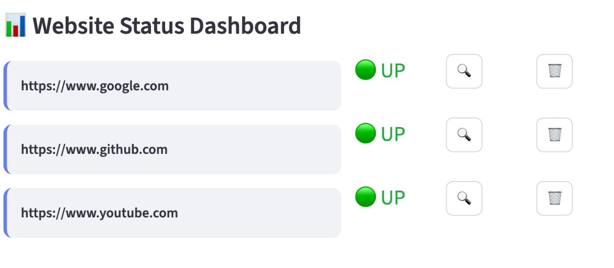

# 🌐 Site Monitor Pro



A real-time website availability monitoring tool built with Streamlit.

## ✨ Features

- **🎯 Real-time Monitoring**: Check website availability with live status updates
- **📊 Interactive Dashboard**: Beautiful stats cards showing total, online, and offline sites
- **🚀 Modern UI**: Gradient styling, custom CSS, and responsive design
- **⚡ Individual Controls**: Check or remove sites individually with dedicated buttons
- **📈 Progress Tracking**: Live progress bar during bulk checks
- **🎉 Engaging UX**: Balloons animation, spinners, and status messages
- **🔄 Auto-formatting**: Automatically formats URLs to ensure consistency

## 🛠️ Tech Stack

- **Python 3.7+**
- **Streamlit** - Web app framework with native components
- **Requests** - HTTP library for site checking

## 🚀 Getting Started

### Prerequisites
```bash
pip install streamlit requests
```

### Running the Application
```bash
streamlit run src/website_checker.py
```

The app will open in your browser at `http://localhost:8501`

## 📁 Project Structure
```
site-monitor-pro/
│
├── src/
│   └── website_checker.py          # Main Streamlit application
│
├── README.md
└── screenshot.jpg       # Dashboard preview
```

## 🎮 How to Use

1. **Add Websites**: Enter any website URL (e.g., `google.com`, `github.com`)
2. **Monitor Status**: Click "🔍 Check All Sites" to test all websites
3. **View Dashboard**: See real-time stats and status indicators
4. **Individual Actions**: Use 🔍 to check single sites or 🗑️ to remove them
5. **Manage List**: Use "🔄 Refresh All" or "🗑️ Clear List" for bulk actions

## 🔧 Core Functions

### `format_url(url)`
Normalizes user input URLs to a consistent `https://www.` format:
- Strips existing protocols (`http://`, `https://`)
- Removes `www.` prefix if present
- Prepends `https://www.` for consistency

### `check_site_availability(url)`
Tests website availability:
- Sends GET request with 5-second timeout
- Uses desktop User-Agent to avoid blocking
- Returns `True` for 200 status, `False` otherwise
- Handles network exceptions gracefully

### `main()`
Streamlit UI with native components:
- Pure Streamlit styling and widgets
- Stats dashboard with `st.metric()` cards
- Form-based input with validation
- Progress tracking for bulk operations
- Individual site management controls

